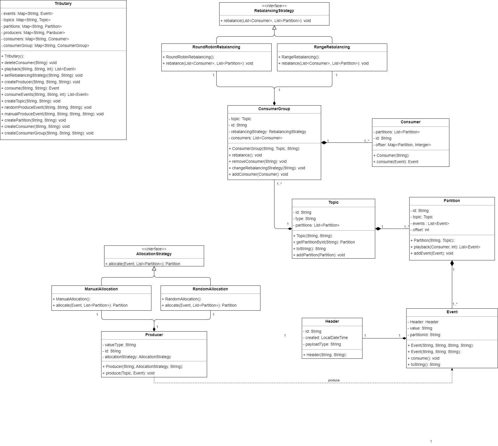

# Tributary:an Event-Driven-Architecture

## Overview

这个Java API为工程师提供了构建可扩展的事件驱动系统的基础工具，用于软件组件之间的异步通信。
该库是Apache Kafka的高度简化版本，用于学习和实践目的。

## 核心特性

- **Tributary集群**：系统中的顶层结构，包含多个主题(Topic)，类似于数据库中的表或文件系统中的文件夹。
- **复杂的主题结构(Topic)**：主题是事件的逻辑分组，包含多个分区(Partition)。每个主题是按照特定类别（例如图片或视频事件）组织的事件集合
- **分区(Partition)**：每个主题中的分区是消息的有序集合，消息被追加到分区的末尾。这允许系统保持消息的顺序，并为并发消费提供基础。
- **消息生命周期**：支持生产者将事件发送到特定的分区，可以选择随机分配或者按照指定的键值分配。消费者按顺序消费分配给它们的分区中的事件。
- **事件（event)**：一个事件包含日期时间、ID、有效载荷类型、键和值等信息。由于不同的主题会对应不同的事件，我们在这里使用了泛型用以支持多种数据类型
- **消费者(consumer)**:负责消费分区中的消息。消费者是消费者组(Consumer Group)的一部分，按照消息产生的顺序进行消费。
- **消费者组(consumer group)**：一个消费者组包含多个消费者，能够并行处理一个主题的所有分区。每个分区只能被组内的一个消费者消费。 一个主题可以有多个消费者
- **生产者(producer)**：生产者负责产生事件并添加到Tributary系统中，并分配到分区中，支持随机分配和按照指定的键值分配。
- **消费者再平衡(Consumer Rebalancing)**：在消费者组新增或删除消费者时，将分区重新分配给消费者，支持均匀分配和轮询分配两种分区再平衡策略。
- **消息重放**：能够对存储在队列中的事件从任意位置开始进行重放,

## 系统架构

## 命令行界面 (CLI)
为了运行可用性测试和与Tributary系统的生产者和消费者进行交互，我们提供了一个命令行工具 `TributaryCLI`。以下是支持的命令列表及其描述：
- `create topic <id> <type>`: 创建一个新的主题。
    - 输出：显示id、类型和确认创建的其他相关信息的消息。

- `create partition <topic> <id>`: 在指定id的主题中创建一个新分区。
    - 输出：确认分区创建的消息。

- `create consumer group <id> <topic> <rebalancing>`: 创建一个新的消费者组，并指定初始的重平衡方法。
    - 输出：确认消费者组创建的消息。

- `create consumer <group> <id>`: 在消费者组内创建一个新消费者。
    - 输出：确认消费者创建的消息。

- `delete consumer <consumer>`: 删除指定id的消费者。
    - 输出：确认消费者删除的消息及其之前所在的消费者组的重新平衡输出。

- `create producer <id> <type> <allocation>`: 创建一个新的生产者，该生产者产生给定类型的事件。
    - 输出：确认生产者创建的消息。

- `produce event <producer> <topic> <event> <partition>`: 从给定生产者生产一个新事件到指定主题。
    - 输出：事件ID和当前所在分区的ID。

- `consume event <consumer> <partition>`: 指定消费者消费来自给定分区的事件。
    - 输出：事件的ID和内容，显示消费者已接收到事件。

- `parallel produce (<producer>, <topic>, <event>), ...`: 并行产生一系列事件。
    - 输出：每个事件当前所在的分区ID。

- `parallel consume (<consumer>, <partition>)`: 并行消费一系列事件。
    - 输出：每个消费的事件的内容及其ID。

- `set consumer group rebalancing <group> <rebalancing>`: 更新消费者组的重平衡方法。
    - 输出：确认新重平衡方法的消息。

- `playback <consumer> <partition> <offset>`: 从偏移量处为给定消费者回放事件。
    - 输出：按顺序接收到的每个事件的ID和内容。
- `show topic <topic>`: 打印指定主题的可视化显示，包括所有分区和当前每个分区中的所有事件。

- `show consumer group <group>`: 显示消费者组中的所有消费者，以及每个消费者正在从哪些分区接收事件。

对于更详细的API描述，请查看[API.md](API.md)文件。
